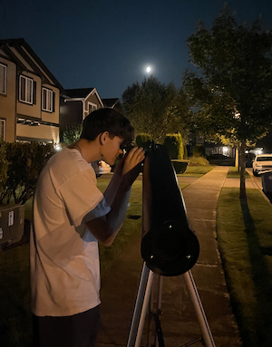
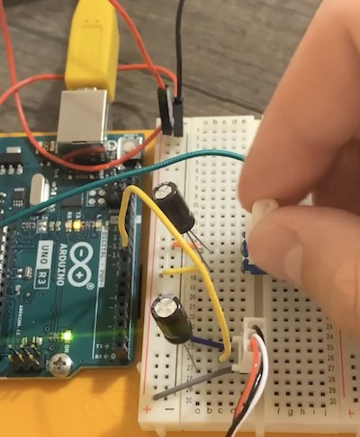
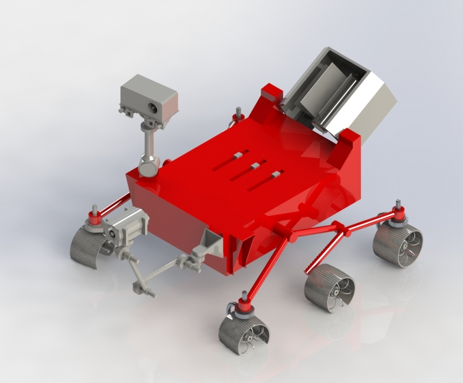

---
title: PAGE TITLE HERE
layout: template
filename: NAME OF THIS .md FILE HERE
--- 

TESTING

# About Me 
Hello!

My name is James Fowler, but I go by Jimmy. I'm a student at the University of Washington studying Aeronautical & Astronautical Engineering. I've always had a thing for space and initially planned to study astrophysics. But after seeing that engineers can make hands-on, tangible contributions towards space exploration, I couldn't imagine a future where I'm doing anything else. Though cosmology still has a special place in my heart, I want to be a part of the mission to explore our solar system, attain lunar permanence, set foot on Mars, and see what kinds of resources we can find on asteroids and icy moons to improve our lives on & off planet Earth.

I love coding, CADing and control theory, and am currently looking for opportunities to apply those to space exploration! 


# Portfolio

#### Technical Skills: MATLAB, Python, C++, PCB Design (KiCAD), CAD (Solidworks + NX)

### >> [What I'm Workin on Now](#aimduino-august-2023---present) << click it!


## Education			        		
- B.S., Aeronautical & Astronautical Engineering, University of Washington, Seattle Campus (_E.C.D. June 2026_)
- A.A., South Puget Sound Community College, Olympia, WA, Concentration: Engineering Physics (_June 2022_)


## Internships

**SLS Rocket Propulsion Hardware Intern @ Boeing (_Septemeber - December 2024_)**
- Supporting the Pneumatics & Pressurization system powering the core stage on the Space Launch System
- Communicate with suppliers to ensure requirements are being met for each component
  
**New Shepard System Architecture Intern @ Blue Origin (_June - September 2024_)**
- Developed an automated data pipeline involving 9 custom MATLAB functions, interfacing with 6 different internal applications and custom programs 
- Presented effective, technical demonstrations of my work to my team and others

**Configuration Aerodynamics Intern @ Boeing (_June - September 2023_)**
- Conducted data processing and analysis with Python for a study evaluating the impact of an issue on 777-9 takeoff performance
- Found the predictive accuracy of the simulation tool through an iterative, scripted (Python) process
  - Gave a technical presentation on the accuracy of the tool and how it should be used

## Part-time Work (to help pay for school)

**Web Developer @ The Academy of Lacey (_March 2022 - Present_)**
- Collaborate with a team of developers to manage over 100 websites owned by Washington State agencies
- Train new employees on tool setup and work procedures
- Utilize Linux command line, HTML, CSS, Javascript, and Git repositories


## Projects

### Controlling an Autonomous Paraglider

Information on this project coming soon!


### **AIMduino (_August 2023 - Present_)**

#### Context


I bought this Bushnell Voyager Sky Tour 900mm x 4.5" Reflector Telescope at a garage sale for *$5* (what a steal!), but it's missing a couple of parts: the two lesser magnifying of the three eyepieces, the dial for fine altitude (vertical) adjustment, the handset meant to guide you with audio, and the finderscope... all items that help me aim the telescope at my celestial target. I could fix this with $200+ in replacement parts, or I could engineer my own alignment system and add functionality that would otherwise be impossible!
I'm calling it *AIMduino* (working title)... Here's the plan:
- Fix a BNO055 IMU to the exterior of the telescope, which has an accurate 3-axis accelerometer and gyroscope so I can read the telescope's current orientation.
- Write calibration script to convert current orientation into azimuth and altitude for the telescope's line of sight
  - Use Stellarium while aiming the telescope at the moon (easy to find) to compare to true Az & Alt, iterate calibration script as needed
- 3D Print rotator hardware and Arduino circuit attachment point
  - Use UW's maker spaces for 3D printing equipment, and mechanical engineering friends for design assistance
- Make a double stepper motor circuit (one for each axis)
  - stepper motors have to interface with custom rotating hardware; this will be very difficult!
  - Given a command, it will rotate horizontally until reaching the target Azimuth, then rotate vertically until the target Altitude.
  

It will go through some design iterations with check-in points:
- V1: Manual orientation/aiming while monitoring Az & Alt outputs
- V2: Horizontal rotation achieved through single stepper motor, controlled with a switch. 
- V3: Input Azimuth to rotate horizontally
- V4: Input Az & Alt of a celestial object and the AIMduino will orient the telescope automatically

I thought this could make a super fun project that would allow me to apply my Arduino and coding knowledge, learn more about mechanical design and telescopes, and upgrade mine for relatively cheap!

#### Status Report
TRL: 3
I've tested the stepper motor (Nema 17) and driver board (A4988) and I've been cooking up some code to control it!

Here is my current (primitive) version of the code to control azimuth orientation:

```
// This program takes a target azimuth from user input from the serial monitor
// and steps the motor to that position in the most efficient direction.
// Assumes initially at 0 degrees
// Azimuth is measured clockwise from true north, 0 - 360 degrees


// set step and direction pins
const int stepPin = 10; 
const int dirPin = 11; 
const float deg_step = 0.1125; // 1.8 degrees per step but 1/16 step w/ microstepping = 0.1125 deg per step
const int speed = 10; // (1 to 10) edit to change step speed
const int step_delay = 5000/speed; 

void setup() {
  Serial.begin(9600);
  // Sets the two pins as Outputs
  pinMode(stepPin,OUTPUT); 
  pinMode(dirPin,OUTPUT);
}

void loop() {

  Serial.println("Enter Target Azimuth");

  // wait until user input is detected
  while (Serial.available() == 0) {
  }

  float target_Az = Serial.parseFloat();  // put user input into target azimuth var
  // float current_Az = ...
  int target_steps = round(target_Az / deg_step); // convert to steps (degrees divided by degrees-per-step = steps)

  if (target_Az > 360 || target_Az < 0) { // invalid azimuth
    Serial.println("Please enter a valid azimuth between 0 and 360 degrees");

  } else if (target_Az <= 180) { // azimuth between 0 and 180
      digitalWrite(dirPin,LOW); // clockwise
      for(int x = 0; x < target_steps; x++) {
        digitalWrite(stepPin,HIGH); 
        delayMicroseconds(step_delay); 
        digitalWrite(stepPin,LOW); 
        delayMicroseconds(step_delay); 
      }

  } else if (target_Az > 180){
      digitalWrite(dirPin,HIGH); // counterclockwise
      for(int x = 0; x < 3200 - target_steps; x++) {
        digitalWrite(stepPin,HIGH); 
        delayMicroseconds(step_delay); 
        digitalWrite(stepPin,LOW); 
        delayMicroseconds(step_delay); 
      }
  }
}
```
Next step: Begin mechanical design of the hardware to rotate the telescope (I'll be using Siemens NX)


### **Learning Arduino (_June - September 2023_)**


Over the Summer, I completed six Arduino projects led by a starter kit book. The goal was to learn circuit design and coding with a variety of instruments and solidify my passion for Arduino.

Some circuit elements & devices I worked with:
- Servo Motors
- LEDs (fixed & RGB)
- Potentiometers
- Capacitors
- Resistors
- Switches/Buttons


### **CADing Perseverance**
At the end of my course on CAD & Visual Communication, we were prompted to model an original assembly of our choice. It was open-ended, but we had to include everything we learned in the class. I chose to model NASA's Mars Perseverance Rover. Even though I kept to a relatively low level of detail, this project was an incredible undertaking, especially while handling other finals.

What I wanted was something that looked mildly realistic, and had some realistic mechanical motion.



I utilized a plethora of mates between each of the 18 parts, and followed best practices while modeling each indiviudal part, and while putting them all together in the assembly.

Here's the project assignment description for more details on requirements. Below that is a .zip with my assembly file and all part files and drawings. Feel free to check it out for yourself!

[Final Project Spring 2023.pdf](https://github.com/jimmyfowler/jimmyfowler.github.io/files/12814128/Final.Project.Spring.2023.pdf)

[Fowler_J_FINAL_Rover.zip](https://github.com/jimmyfowler/jimmyfowler.github.io/files/12814307/Fowler_J_FINAL_Rover.zip)


### **Building an RV-12 (_May 2023 - Present_) (Husky Flying Club)**
I am currently leading a team of 6 engineers to machine and assemble aircraft parts. I Conduct & coordinate team meetings and allocate work to other student engineers on the project. I'm also planning & writing operations & legal documents with an experienced aerospace lawyer.


### **Freewing (_December 2022 - April 2023_) (Husky Flying Club)**
During my Freshman year with the Husky Flying Club, I helped build a freewing canard, radio-controlled aircraft with a ten-foot wingspan costing $3500 in parts. I helped organize our engineers into subteams based on interests and experience and then participated in weekly build meetings to construct the aircraft. I also wrote 8 pages of legal documents in order to safely and legally test-fly our plane once it was built.


